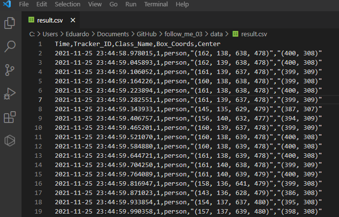

# Follow-Me Project
Real-time Multiple Object Tracking with Yolov4, Tensorflow and Deep SORT.


# 1.0 Installation
It is necessary to install some tools before installation.

## 1.1 Anaconda Installation
The recommendation is to create a variable environment using Anaconda.
- You can install in: https://docs.anaconda.com/anaconda/install/index.html

### 1.1.1 Anaconda for Jetson Nano
- Link 01: https://sahilramani.com/2020/10/how-to-setup-python3-and-jupyter-notebook-on-jetson-nano/
- Link 02: https://docs.anaconda.com/anaconda/install/linux-aarch64/

## 1.2 Nvidia Installation (only GPU Mode)
If you to use GPU mode, you need to install Nvidia Driver and CUDA.

### 1.2.1 GPU Mode Installation
- Install GPU NVIDIA Driver: https://www.nvidia.com/Download/index.aspx
- Install CUDA v10.1: https://developer.nvidia.com/cuda-10.1-download-archive-update2

### 1.2.2 CPU Mode Installation
- It is not necessary


# 2.0 Getting Started
You can run the project in GPU and CPU mode. Follow the instructions below.

## 2.1 Download this Project with Git Clone or Download
### 2.1.1 Git Clone
```bash
git clone https://github.com/eduardocarnunes/follow_me_03
```
### 2.1.2 Download 


## 2.2 Install libraries for GPU or CPU Mode

### 2.2.1 Mode CPU
```bash
conda env create -f conda-cpu.yml
conda activate follow-me-cpu
```
### 2.2.2 Mode GPU
```bash
conda env create -f conda-gpu.yml
conda activate follow-me-gpu
```

## 2.3 Pre-processing
We need convert YOLO to Tensorflow

### Step 1: Create a folder with name: weights 

### Step 2: Download and save weights files into weights folder
- Yolov4: https://drive.google.com/open?id=1cewMfusmPjYWbrnuJRuKhPMwRe_b9PaT

### Step 3: Convert darknet weights to tensorflow model. Execute convert.py in a terminal:
- Yolov4
```bash
python save_model.py --model yolov4
```

# 2.4 Run Multiple Object Tracking

## Insert params in config.yml

```yaml
# True: Camera Real Time 
# False: Video File
is_mode_camera : True 
id_camera : 0

# True: to salve result in .avi 
# False: don't to save in .avi
is_save_result_video : True 

# FPS video result file
fps_save_result : 15

# resolution of camera 
# make_1080p: 1920x1080
# make_720p: 1280x720
# make_480p: 640x480
# make_custom: width x height (set in )
set_resolution : make_1080p
# uses when make_custom
resolution_custom_width : 640
resolution_custom_height : 480

# Input Size Yolo. Must be multiple of 32
input_size_yolo : 640

# If is_mode_camera == False, put video path .mp4
video_path_test : ./data/video/test2.mp4

# If is_save_result_video == True, put video path .avi
video_path_result : ./data/result/result_test2.avi

# True: show preview result 
is_preview_result : True
# True: info (id, coords, class name) show 
is_show_result_cmd : False
# True: show result topside on preview
is_show_count_object : True

# True: Save all result in a .csv file
is_save_result_csv : False
# If save_info_result == True, path file where .csv will save
path_file_csv : ./data/result.csv

# allowe classes Yolov4 for detection
allowed_classes : 
  - person
  - car
```

## Run detection
```bash
python multiple_object_tracker.py
```


# Some Results

## Mode Video File with GPU:


## Mode Video File with CPU:


## Mode WebCam Real Time with GPU:


## Result info in .csv



# License list of libraries and tools used for this project:
- **Anaconda (Python distribution)** : Free use and redistribution under the terms of the EULA for Anaconda Individual Edition.
- **matplotlib** : https://matplotlib.org/stable/users/project/license.html
- **OpenCV** : https://opencv.org/license/
- **cudnn** : https://docs.nvidia.com/deeplearning/cudnn/sla/index.html#license
- **cudatoolkit** : https://docs.nvidia.com/cuda/eula/index.html#abstract
- **tensorflow-gpu** : https://www.tensorflow.org/install/gpu
- **lxml** : https://lxml.de/index.html#license
- **tqdm** : https://github.com/tqdm/tqdm/blob/master/LICENCE
- **absl-py** : https://github.com/abseil/abseil-py/blob/main/LICENSE
- **easydict** : https://github.com/makinacorpus/easydict/blob/master/LICENSE
- **pillow** :  https://pillow.readthedocs.io/en/stable/about.html#license
- **PyYAML** : https://pypi.org/project/PyYAML/
- **pandas** : https://pandas.pydata.org/pandas-docs/stable/getting_started/overview.html#license- 
